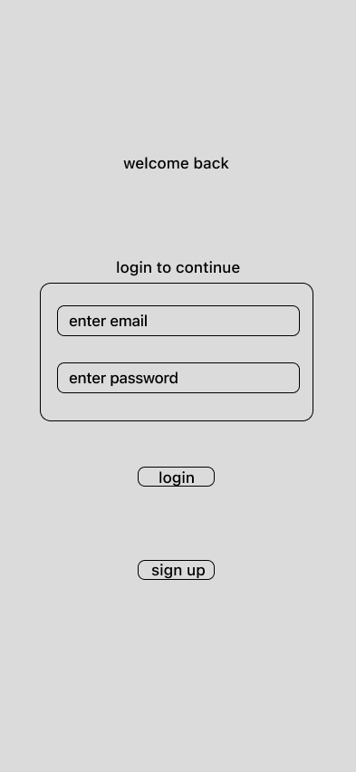
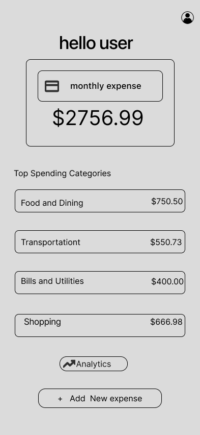
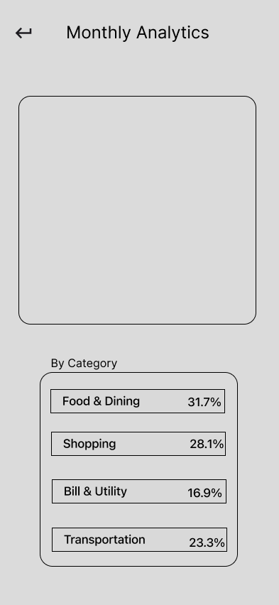
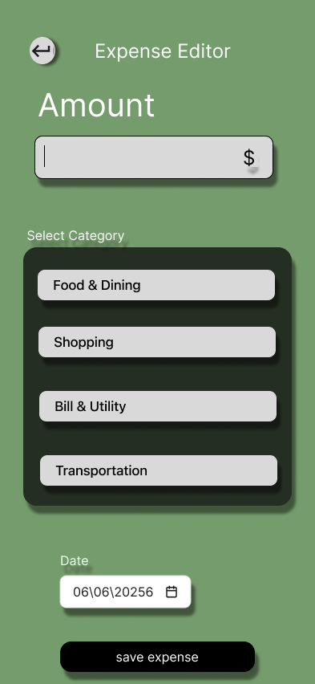

##Figma Design:
https://www.figma.com/design/cP44p4pG1X1azZYcJjhvgc/task-1?node-id=0-1&t=FamCgex7ls5sA2Qd-1

FinTrack is a modern mobile finance management app designed to help users track expenses, manage budgets, and analyze spending habits. The application features expense recording, spending analytics, budget monitoring, and a clean user-friendly interface built in Figma.

## Features

* User Authentication (Login & Sign Up)
* Expense Tracking
* Budget Management
* Spending Analytics & Charts
* User Profile & Settings
* Clean and Responsive UI Design

## Tools Used

* Figma (UI/UX Design)

## Project Type

FinTech Mobile Application

## Designer

Blesson Joy
## Screenshots

### Splash Screen

### Login Screen

### Dashboard

### Analytics

### Add Expense

