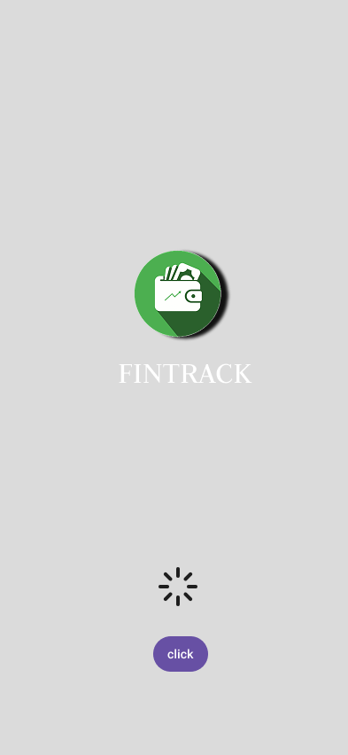
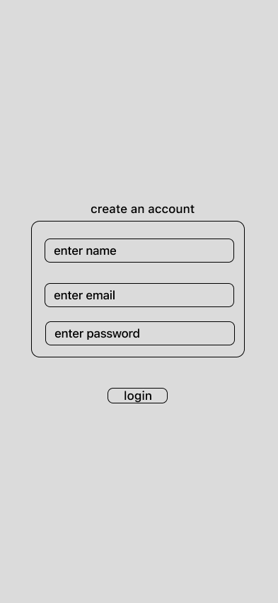
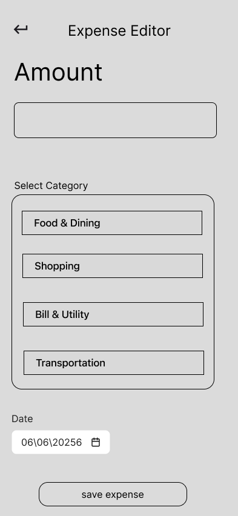
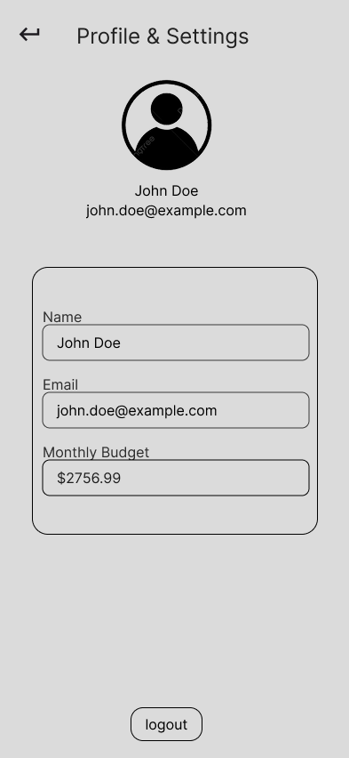

#  FinTrack – Smart Personal Finance & Expense Tracking App
# figma link:https://www.figma.com/design/cP44p4pG1X1azZYcJjhvgc/task1?node-id=76-82&t=5JVZOx8BxvSXqqBx-1
##  Project Overview

FinTrack is a mobile application designed to help users record daily expenses, monitor budgets, and understand their spending habits. The app focuses on simplicity and ease of use, enabling users to manage their personal finances efficiently.

---

#  Problem Statement

Many people struggle to keep track of their daily expenses and monthly budgets. Manual tracking methods are often inconvenient and lead to poor financial awareness. FinTrack provides a user-friendly solution to record expenses, analyze spending patterns, and make informed financial decisions.

---

#  Objectives

* Record expenses quickly and easily.
* Monitor monthly spending.
* Categorize transactions for better organization.
* Visualize financial data through reports and charts.
* Encourage better budgeting habits.

---

#  UX Research

## Target Audience

* College students
* Young professionals
* Freelancers
* Individuals managing household expenses

## User Goals

* Track daily expenses.
* Stay within a monthly budget.
* View spending summaries.
* Identify unnecessary expenses.
* Improve financial planning.

## Pain Points

* Forgetting to log expenses.
* Complex finance applications.
* Difficulty understanding spending patterns.
* Time-consuming manual tracking.

## Key Insights

Users prefer a clean interface, fast expense entry, simple navigation, and visual reports that clearly summarize their financial activity.

---

#  User Persona

**Name:** Arjun Nair
**Age:** 22
**Occupation:** College Student

### Goals

* Track daily expenses with minimal effort.
* Save money by monitoring spending.
* Stay within a monthly budget.

### Frustrations

* Existing apps are too complicated.
* Often forgets to record expenses.
* Hard to identify where money is being spent.

### Needs

* Quick expense entry.
* Easy-to-read dashboard.
* Budget reminders.
* Spending reports and charts.

**Quote:**
*"I want an app that helps me understand where my money goes without making budgeting feel complicated."*

---

#  User Flow

```text
Start
  ↓
Login / Sign Up
  ↓
Dashboard
  ↓
Add Expense
  ↓
Enter Expense Details
  ↓
Save Expense
  ↓
Updated Dashboard
  ↓
View Reports
  ↓
Track Budget
  ↓
Logout
  ↓
End
```

---

# 🗺️ User Journey Map

| Stage       | Goal                    | Action                       | Pain Point                | Opportunity                 |
| ----------- | ----------------------- | ---------------------------- | ------------------------- | --------------------------- |
| Discover    | Find an expense tracker | Install FinTrack             | Too many complex apps     | Keep onboarding simple      |
| Login       | Access the app          | Sign in or create an account | Lengthy registration      | Fast sign-up flow           |
| Dashboard   | View financial summary  | Check balance and expenses   | Information overload      | Clean, minimal design       |
| Add Expense | Record spending         | Enter amount and category    | Too many steps            | Quick expense form          |
| Reports     | Analyze spending        | View charts and summaries    | Difficult-to-read reports | Visual insights             |
| Budget      | Stay within limits      | Monitor remaining budget     | Forgetting limits         | Notifications and reminders |

---

#  Wireframes

Low-fidelity wireframes were created to define the layout, navigation, and user interactions before high-fidelity design and prototyping.










#  Design Principles

* Simple and intuitive interface
* Minimal user effort
* Consistent navigation
* Clear visual hierarchy
* Easy access to core features

---

#  Tools Used

* Figma (Wireframing & Prototyping)
* Draw.io / Miro (User Flow Diagrams)
* Google Docs / Markdown (Documentation)

---

#  Key Features

* Add and manage expenses
* Dashboard with financial summary
* Budget tracking
* Category-wise expense organization
* Reports and spending analysis
* User-friendly mobile interface

---

#  Conclusion

FinTrack is designed to simplify personal finance management by offering an intuitive experience for tracking expenses and budgets. The UX research and design process focus on reducing complexity while helping users make smarter financial decisions.
